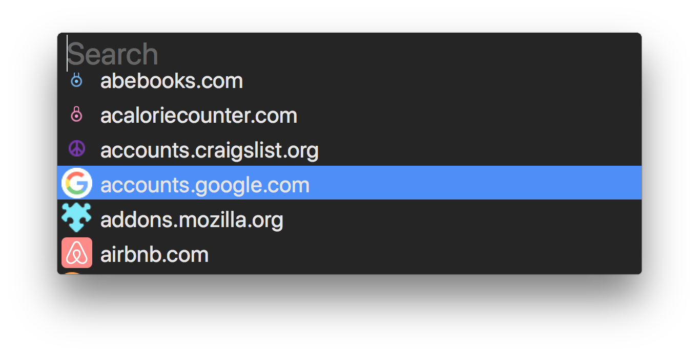

## PassHUD

A HUD-style interface for [zx2c4's `pass`](https://www.passwordstore.org) on
macOS. Depends on `pass` being installed and configured.



### Usage

Trigger PassHUD by clicking its lock menu bar icon, or by using its keyboard
shorcut `⌘ /`.

PassHUD fuzzy-finds passwords as you type. Click passwords to copy them to the
clipboard or just hit `Enter` once the password is highlighted. PassHUD keeps
recently used passwords at the top of the list for easy access.

Passwords are written to the clipboard directly by `pass` and are never seen by
PassHUD. Default `pass` clipboard clearing behavior applies.

### Installation

Download the project and open it in Xcode. In the menu bar, go to `Product` ->
`Archive` and click `Distribute App`. Select `Copy App`, and hit `Next` to
specify a destination for the compiled output. After the archive is built just
start it like a normal macOS app.

### Configuration

PassHUD can be configured with an optional config file that should be created at
one of the following paths:

* `~/.PassHUD`
* `~/.config/PassHUD/config`

The config file is YAML and can set environment variables for PassHUD's
execution of `pass`, and an optional path to `pass` itself. If a path isn't
provided `pass` must be on your `$PATH`. All fields in the config are optional.
Here's an exhaustive example config file:

```yaml
---
version: 1
pass:
  commandPath: ~/a/non/default/path/to/pass
  env:
    - name: PASSWORD_STORE_DIR
      value: ~/a/non/default/password/store/path
```
